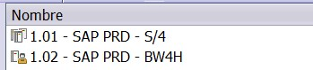
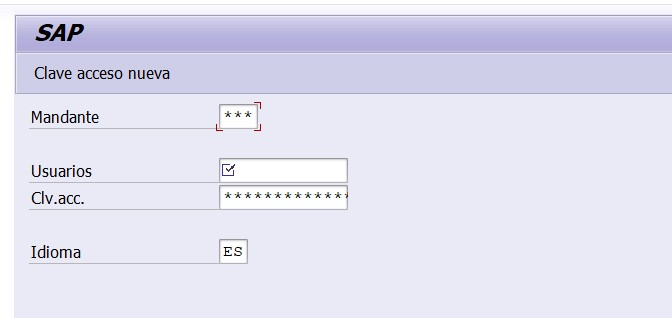

# Manipulación de Sesiones y Conexiones en SAP

Una de las cosas más molestas a las que me he tenido que enfrentar cuando he automatizado algún proceso en SAP es que no puedo ejecutar un script si:

- No estoy previamente logueado
- Estoy en dos ambientes a la vez (a veces revisando QA y a veces PRD o R3) y mi script lee la primera, sin importar cuál sea
- Ya estoy ejecutando un script y tengo que esperar a que termine para poder ejecutar otro script

Por tanto, aquí les paso un desarrollo que hice para poder hacer mucho más flexible y dinámicas las conexiones a SAP, para que puedan ejecutar múltiples procesos y que no dependan de que estén logueados o no a SAP.

## Comprendiendo el Script

Para poder empezar, hay que entender algunos conceptos previos. Por ejemplo, cuando uno graba un script de SAP, se genera un archivo en Visual Basic con estas líneas al inicio del código por defecto.

```vbnet
If Not IsObject(application) Then
   Set SapGuiAuto  = GetObject("SAPGUI")
   Set application = SapGuiAuto.GetScriptingEngine
End If
If Not IsObject(connection) Then
   Set connection = application.Children(0)
End If
If Not IsObject(session) Then
   Set session    = connection.Children(0)
End If
If IsObject(WScript) Then
   WScript.ConnectObject session,     "on"
   WScript.ConnectObject application, "on"
End If
```

## Validar si SAP ya está abierto o no en el ordenador

Uno de los requisitos del script es: Tienes que ya tener SAP logueado. Por tanto, si ni siquiera está abierto, saldrá error y tendrás que hacerlo manualmente, lo cual puede ser un poco molesto cuando son procesos que queremos que fluyan de la mejor manera.

En esta función, lo que haremos es abrir SAP desde el ejecutable que, en este caso, lo tengo en C:

```python
import subprocess

def open_sap():
    # Ruta SAP
        sapgui_executable = r"C:\Program Files (x86)\SAP\FrontEnd\SAPgui\saplogon.exe"
    try:
        subprocess.Popen([sapgui_executable])
    sleep(5)
        except Exception as e:
        print("Error OPEN_SAP:", str(e))
```
Luego, con un try-except, lo que haremos es tratar de conectarnos directamente a SAP. Si hay un error (porque no está abierto), ejecutaremos la función SAP para abrirlo desde el ejecutable y ahora sí nos permitirá acceder como siempre.

```python

import win32com.client as win32

print('Generando conexión SAP...')
try:
    SapGuiAuto  = win32.GetObject("SAPGUI")
except:
    print('Abriendo SAP...')
    open_sap()
    SapGuiAuto  = win32.GetObject("SAPGUI")

```

        
## Definición de Variables
Para empezar, tenemos que describir las dos primeras variables definidas. No voy a profundizar en estas variables, debido a que no las modificamos. Simplemente las dejamos como tal y luego las adaptamos a Python.

Primero, esta línea nos permite acceder al entorno de SAP GUI para poder controlarlo con el script
``` vbnet
Set SapGuiAuto  = GetObject("SAPGUI")
```
Dentro del entorno, esta línea nos permite interactuar con la interfaz de SAP (llenar campos, presionar botones, etc.) mediante código
``` vbnet
Set application = SapGuiAuto.GetScriptingEngine
```

## Conexión SAP

Ahora que explicamos los dos primeros componentes del código, tenemos que entender lo que es la conexión SAP.

La conexión es el enlace que nos permite comunicarnos con un servidor SAP. La conexión suele ser lo que nos aparece en la primera ventana. Por ejemplo, en este caso, es el **'1.01 - SAP PRD - S/4'**



Por defecto, es la primera conexión disponible (definida como application.Children(0)). Si no sueles usar más de una conexión, esto no debería ocasionar problemas, pero si sueles entrar a una conexión de QA y a otra de PRD, va a tomar la primera disponible (sea cual sea).

Para empezar, tenemos que indicarle a Python cuál es nuestra conexión deseada. El nombre de dicha conexión debe coincidir con lo que se nos muestra en la ventana de SAP.

```python
# Declaramos la conexión a la que queremos ingresar 
sap_s4 = '1.01 - SAP PRD - S/4'
```

Luego, con un bucle for, revisamos todas las conexiones disponibles y obtenemos la propiedad "Description" para obtener el nombre de la conexión. 

Cabe mencionar que el "application.Children" es una matriz, por lo que podemos iterar sobre ella y acceder a los atributos de cada elemento de matriz.

```python

# Definimos la variable conexión
connection = None
 
# Revisar si hay conexiones activas de SAP
for i,conn in enumerate(application.Children):

    # Si la conexión se parece a nuestra variable previamente definida, tomamos esa y salimos del bucle
    if conn.Description == sap_s4:
        print(f'Conexión {i + 1} correcta')
        connection = conn
        break
```

Si no encontramos nuestra conexión deseada, podemos usar la función "OpenConnection" para abrir la conexión. Ahí se nos habilita la ventana de SAP donde podremos ingresar nuestro usuario y contraseña.

```python

if connection:
    # Si la conexión activa es igual a la conexión deseada, definir esa conexión
    print(f'Conexión SAP: {connection.Description}')
else:
# Si no está abierta la conexión deseada, abrir una nueva
    print('Conexión no encontrada. Abriendo conexión')
    connection = application.OpenConnection(sap_s4,True)
    session = connection.Children(0)
    
    # Llenar usuario y contraseña
    session.findById("wnd[0]/usr/txtRSYST-BNAME").text = user
    session.findById("wnd[0]/usr/pwdRSYST-BCODE").text = password
    session.findById("wnd[0]").sendVKey(0)

```



## Sesión SAP

La sesión es -de manera práctica- la ventana en la que se va a ejecutar nuestro script. Por defecto, el script toma la primera ventana (definida como Connection.Children(0)). 

Es por esto mismo que muchas veces no podemos ejecutar dos scripts a la vez ya que, si no modificamos las sesiones, ambas harán referencia a la misma sesión, lo que las hará entrar en conflicto y solo se ejecutará la primera.

Una vez que ya tenemos nuestra conexión ya establecida, vamos a indicarle a SAP qué ventana vamos a utilizar para nuestra automatización. 

Por un tema de practicidad, valido si solo tengo una ventana abierta. De ser así, uso la función "CreateSession()" para abrir una nueva ventana. Esto debido a que usualmente el script bloquea el uso de la ventana y, si llegara a necesitar hacer algo en paralelo, no podría hacerlo hasta que termine el proceso.

```python

# Definimos la variable session primero
session = None
 
# Obtenemos el total de sesiones activas
sessions = connection.Children.Count

 # Si solo hay una sesión activa. Crear una nueva
if sessions == 1:
    connection.Children(0).CreateSession()

```

Ahora revisamos cada ventana activa. Esta parte ya depende del criterio de cada uno. En mi caso, prefiero revisar si tengo una ventana en "SESSION_MANAGER". Es decir, no hay ninguna transacción activa. Si no hay ninguna, la selecciono y salgo del bucle.

```python
# Primero chequeamos si hay alguna ventana en el SESSION_MANAGER, lo que quiere decir que está libre
for i, ses in enumerate(connection.Children):

    #print(ses.Info.Transaction)
     
    if ses.Info.Transaction == 'SESSION_MANAGER':
        # Si la transacción activa es el SESSION MANAGER, usar esa
        print(f'Sesion {i + 1} libre')
        session = ses
        break
    elif ses.Info.Transaction == 'S000':
        # Esta parte sirve para acceder si es que estamos en la ventana de login, pero aún no hemos accedido a nuestra cuenta
        print(f'Sesion {i + 1} en ventana de login. Iniciando sesión...')
        # Llenar usuario y contraseña
        session = ses
        session.findById("wnd[0]/usr/txtRSYST-BNAME").text = user
        session.findById("wnd[0]/usr/pwdRSYST-BCODE").text = password
        session.findById("wnd[0]").sendVKey(0)
        break
```

Si es que no hay ninguna ventana en el SESSION_MANAGER, revisamos cada ventana y, si está ocupada, la ignoramos y pasamos a la siguiente. Para esto, necesitamos usar la propiedad **Busy** de las sesiones.

En cambio, si la ventana no está realizando algún proceso, la tomamos y salimos del bucle.

``` python
# Si no hay ninguna en el SESSION_MANAGER, tomamos la primera que no esté ocupada
if not session:
    for i, ses in enumerate(connection.Children):
        if ses.Busy == True:
            # Si la sesión está ocupada. Es decir, en proceso de carga de otra transacción, pasar a la siguiente.
            print(f'Sesion {i + 1} ocupada. Ir a la siguiente')
            else:
            # Si la sesión no está ocupada, tomar esa.
            print(f'Sesion {i + 1} activa. Utilizar')
            session = ses
            break
 
```

## Acciones

Una vez que ya tenemos la sesión definida, ya podemos ejecutar los pasos de nuestro script, como inicializar transacciones, descargar reportes, etc.

``` python
# De aquí en adelante, ya podemos correr nuestros procesos
session.StartTransaction("FBL1N")
```

Finalmente, este script nos permite una mayor versatilidad para manipular las conexiones y las sesiones.

- Si SAP está cerrado, abrimos SAP, nos logueamos de forma automática y corremos algún proceso.
- Si SAP está abierto y no estamos logueados, iniciamos sesión y avanzamos
- Si ya estamos logueados, usaremos la primera ventana disponible que no esté haciendo algo. Esto ayuda a que, si necesitamos correr otro script luego, este no interfiera con la primera ejecución.

Puedes acceder al código completo aquí: 
