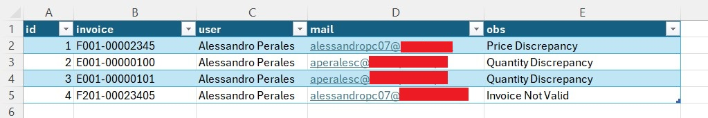
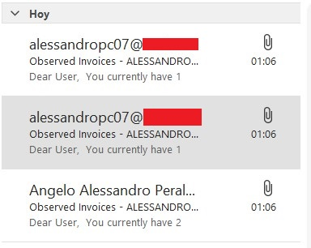
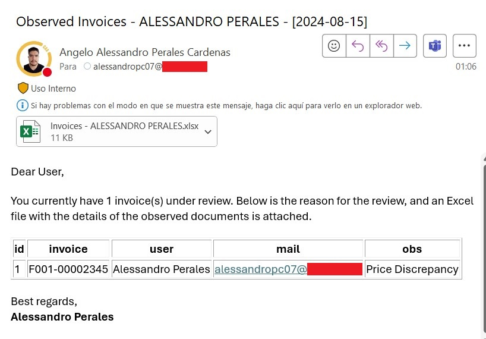
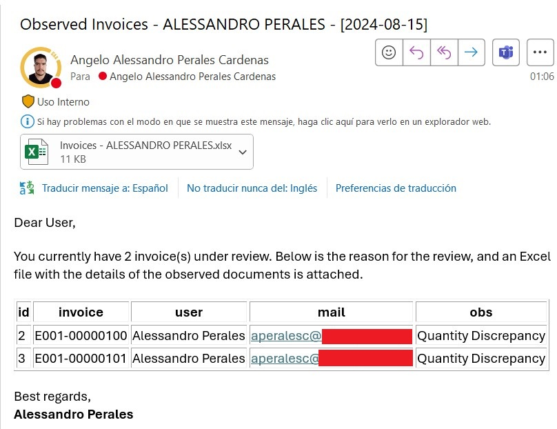

# How to send Outlook mails from a Dataframe using Python

One of the manual tasks I had to do was to notify users about discrepancies in their invoices, as there were various issues  that prevented the document from being registered.

Notifying users one by one honestly took a lot of time, due to the number of users and the reasons that needed to be indicated for each user. Additionally, any manual process is prone to error.

For this reason, I’m presenting a simplified workflow on how you can send mass notifications to users using Python, by reading data from a DataFrame.

I know you can also use Excel VBA, which is a valid option as well. However, I'm offering another alternative here. 

One of the advantages I found in using Python is that VBA locks Excel until the process is completed, something Python does not do. So, if you have many emails to send, Python can handle it while you continue working on other Excel files.


## 1. Importing Libraries

First, we're going to need these libraries.

```python
import pandas as pd
import win32com.client 
import os 
from datetime import datetime
```

## 2. Declaring main variables

I use datetime to add the date in the notification. It's more of a personal approach and probably someone would find this useful.

```python
current_time = datetime.now()
date_format = current_time.strftime('%Y-%m-%d')
```
Then, we declare the paths where will be our files.

```python
filepath = 'C:\\Users\\aperalesc\\Desktop\\github\\python_mails'
attachments_filepath = 'C:\\Users\\aperalesc\\Desktop\\github\\python_mails\\attachments'
filename = 'data.xlsx'
```

And finally, we make the connection to Outlook.

```python
# Connect with outlook
outlook = win32com.client.Dispatch('outlook.application')
```

## 3. Create Send mail function

Now, we define the function "send_mails". Here we're going to add all the inputs required for our notification (the user mail, body, subject, attachments, etc.)

```python
def send_mails(usermail,username):

    # This code creates a MailItem object which allows us to modify the properties 
    mail = outlook.CreateItem(0)

    mail.To = usermail # the recipient of the mail
    #mail.cc = mail - You can add any mail here if you want to copy someone
    
    mail.Subject = f'Observed Invoices - {username.upper()} - [{date_format}]'

    # In this part, we will 
    # While it's not necessary to do it in html (You can use 'mail.Body' instead), HTMLBody allows you to add some format like bold font, italics, etc.
    texto_html = f'''
    <!DOCTYPE html>
    <html lang="es">
    <head>
    <meta charset="UTF-8">
    <meta name="viewport" content="width=device-width, initial-scale=1.0">
    </head>
    <body>
    <p>Dear User,</p>
    <p>You currently have {total_rows} invoice(s) under review. Below is the reason for the review, and an Excel file with the details of the observed documents is attached.</p>  
    {df_html}
    <p>Best regards,<br>
    <strong>Alessandro Perales</strong></p>
    </body>
    </html>
    ''' 
    mail.HTMLBody = texto_html

    # Add the excel created as attachment
    mail.Attachments.Add(attachments_fullpath)

    # Finally, send the email
    mail.Send()

```

## 3. Reading DataFrame

At this point, we start reading our dataframe. In this case, I have an excel file with few rows, just for this example, as shown below.



We use the read_excel function to get the data.

```python
df = pd.read_excel(os.path.join(filepath,filename),
                   sheet_name='invoices',  # It's always a good practice to declare the exact sheet name, just in case
                   dtype=str) # I prefer to manually change the type of my columns
```

Here, we want to notify every mail once. So, we have to keep the unique values. For this task, we're going to use the set function.

Set is an iterable object in python which doesn't allow duplicates. It's not a list, but somewhat similar.

As you can see, I had 4 rows in my data, but just three different mails.

```python
# Select all unique mails
user_mails = set(df['mail'].values)
```

## 4. Looping through all mails

Now we have the unique user mails, we'll add a For loop to send mails for each mail in the set. Basically, this loop does this:

1. Filter the database to keep the rows where the mail column is the same of the current item in the set
2. Then, we extract the name of the user
3. Export temporarily the dataframe to a Excel file which it's going to be attached to the mail
4. Create and HTML table with the filtered dataframe to insert it in the mail body
5. Send the mail to the user
6. Delete the attachment file created (if you don't want to keep it)

```python
# We're going to send mails for all unique mails in our dataframe
for user_mail in user_mails:
    
    print(f'Sending mail to {user_mail}...')
    print('')

    # First, we select the rows 
    df_notification = df[df['mail']==user_mail]

    # Then, we select. In this particular case, we have the name in the table so an iloc function is ok
    # If you want to extract more information related to this user,
    # you'll have to call a master table previously
    user_name = df_notification['user'].iloc[0]

    # Declaring attachment variables
    attachments_filename = f'Invoices - {user_name.upper()}.xlsx'
    attachments_fullpath = os.path.join(attachments_filepath,attachments_filename) 

    # Export the Dataframe as an Excel. We're going to add as an attachment
    df_notification.to_excel(attachments_fullpath,index=False)

    # We will need these inputs for our notification
    df_html = df_notification.to_html(index=False) # The dataframe in HTML
    total_rows = len(df_notification) # The number of rows, just for information

    # Call function
    send_mails(user_mail,user_name)

    # You can delete the file after you send it if you don't want to keep it
    os.remove(attachments_fullpath) 

print('Done!')
```

Here are some captions of the mails sent.



As you can see, the mail has everything we put in the send_mail function, including the attachment, the date in the subject, etc.




Finally, here is the link to the python script file [mail_notifications.py](python_scripts/mail_notifications.py)

Hope you find this useful! 
