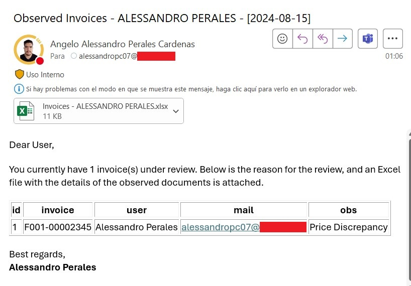

## Cómo enviar correos de Outlook desde un DataFrame usando Python

Una de las tareas manuales que tenía que realizar era notificar a los usuarios sobre discrepancias en sus facturas, ya que había varios problemas que impedían registrar el documento.

Notificar a los usuarios uno por uno realmente tomaba mucho tiempo, debido a la cantidad de usuarios y los motivos que debían ser indicados para cada uno. Además, cualquier proceso manual es propenso a errores.

Por esta razón, presento un flujo de trabajo simplificado sobre cómo puedes enviar notificaciones masivas a los usuarios usando Python, leyendo datos de un DataFrame.

Sé que también puedes usar VBA de Excel, lo cual es una opción válida. Sin embargo, aquí te ofrezco otra alternativa.

Una de las ventajas que encontré al usar Python es que VBA bloquea Excel hasta que el proceso se completa, lo cual Python no hace. Así que, si tienes muchos correos que enviar, Python puede manejarlo mientras sigues trabajando en otros archivos de Excel.

## 1. Importar librerías
 
Primero, necesitaremos estas librerías.

```python
import pandas as pd
import win32com.client 
import os 
from datetime import datetime
```

## 2. Declarar Variables Principales
   
Normalmente uso datetime para agregar la fecha en la notificación. Es más un enfoque personal y probablemente alguien lo encontraría útil.

```python
current_time = datetime.now()
date_format = current_time.strftime('%Y-%m-%d')
```
Luego, declaramos las rutas donde estarán nuestros archivos.

```python
filepath = 'C:\\Users\\aperalesc\\Desktop\\github\\python_mails'
attachments_filepath = 'C:\\Users\\aperalesc\\Desktop\\github\\python_mails\\attachments'
filename = 'data.xlsx'
```

Y finalmente, establecemos la conexión con Outlook.

```python
# Connect with outlook
outlook = win32com.client.Dispatch('outlook.application')
```

## 3. Crear la Función de Envío de Correos

Ahora, definimos la función "send_mails". Aquí vamos a agregar todos los inputs necesarios para nuestra notificación (el correo del usuario, cuerpo del mensaje, asunto, archivos adjuntos, etc.)

```python
def send_mails(usermail,username):

    # Este código crea un objeto MailItem que nos permite modificar las propiedades
    mail = outlook.CreateItem(0)

    mail.To = usermail # el destinatario del correo
    #mail.cc = mail - Puedes agregar cualquier correo aquí si deseas copiar a alguien
    
    mail.Subject = f'Observed Invoices - {username.upper()} - [{date_format}]'

    # En esta parte, utilizaremos HTML para agregar formato como negritas, cursivas, etc.
    # While it's not necessary to do it in html (You can use 'mail.Body' instead), HTMLBody allows you to add some format like bold font, italics, etc.
    texto_html = f'''
    <!DOCTYPE html>
    <html lang="es">
    <head>
    <meta charset="UTF-8">
    <meta name="viewport" content="width=device-width, initial-scale=1.0">
    </head>
    <body>
    <p>Dear User,</p>
    <p>You currently have {total_rows} invoice(s) under review. Below is the reason for the review, and an Excel file with the details of the observed documents is attached.</p>  
    {df_html}
    <p>Best regards,<br>
    <strong>Alessandro Perales</strong></p>
    </body>
    </html>
    ''' 
    mail.HTMLBody = texto_html

    # Agregar el archivo de Excel creado como adjunto
    mail.Attachments.Add(attachments_fullpath)

    # Finalmente, enviamos el correo
    mail.Send()

```

## 3. Leer el DataFrame

En este punto, comenzamos a leer nuestro DataFrame. En este caso, tengo un archivo de Excel con pocas filas, solo para este ejemplo, como se muestra a continuación.


Usamos la función read_excel para obtener los datos.

```python
df = pd.read_excel(os.path.join(filepath,filename),
                   sheet_name='invoices',  # Siempre es una buena práctica declarar el nombre exacto de la hoja, por si acaso
                   dtype=str) # Prefiero cambiar manualmente el tipo de mis columnas
```

Aquí, queremos notificar cada correo una vez. Por lo tanto, debemos mantener los valores únicos. Para esta tarea, usaremos la función set.

Un **set** es un objeto iterable en Python que no permite duplicados. No es una lista, pero es algo similar.

Como puedes ver, tenía 4 filas en mis datos, pero solo tres correos diferentes.

```python
# Seleccionar todos los correos únicos
user_mails = set(df['mail'].values)
```

## 4. Iterar a través de todos los correos

Ahora que tenemos los correos electrónicos únicos, añadiremos un bucle For para enviar correos a cada uno en el conjunto. Básicamente, este bucle hace lo siguiente:

1. Filtra la base de datos para mantener las filas donde la columna de correo es la misma que el elemento actual en el conjunto
2. Luego, extrae el nombre del usuario
3. Exporta temporalmente el DataFrame a un archivo Excel que se adjuntará al correo
4. Crea una tabla HTML con el DataFrame filtrado para insertarla en el cuerpo del correo
5. Envía el correo al usuario
6. Elimina el archivo adjunto creado (si no deseas mantenerlo)

```python
# Vamos a enviar correos para todos los correos únicos en nuestro DataFrame
for user_mail in user_mails:
    
    print(f'Sending mail to {user_mail}...')
    print('')

    # Primero, seleccionamos las filas 
    df_notification = df[df['mail']==user_mail]

    # Luego, seleccionamos el nombre del usuario. En este caso particular, tenemos el nombre en la tabla, por lo que una función iloc está bien
    # Si deseas extraer más información relacionada con este usuario,
    # tendrás que llamar a una tabla maestra previamente
    user_name = df_notification['user'].iloc[0]

    # Declarar variables de archivo adjunto
    attachments_filename = f'Invoices - {user_name.upper()}.xlsx'
    attachments_fullpath = os.path.join(attachments_filepath,attachments_filename) 

    # Exportar el DataFrame como un archivo Excel. Lo agregaremos como un adjunto
    df_notification.to_excel(attachments_fullpath,index=False)

    # Necesitamos estos inputs para nuestra notificación
    df_html = df_notification.to_html(index=False) # El DataFrame en HTML
    total_rows = len(df_notification) # El número de filas, solo para información

   # Llamar a la función
    send_mails(user_mail,user_name)

    # Puedes eliminar el archivo después de enviarlo si no deseas mantenerlo
    os.remove(attachments_fullpath) 

print('Done!')
```

Aquí hay algunas capturas de los correos enviados.


Como puedes ver, el correo tiene todo lo que pusimos en la función send_mails, incluyendo el archivo adjunto, la fecha en el asunto, etc.




Finalmente, aquí está el enlace al archivo del script de Python [mail_notifications.py](python_scripts/mail_notifications.py)

¡Espero que lo encuentres útil!
